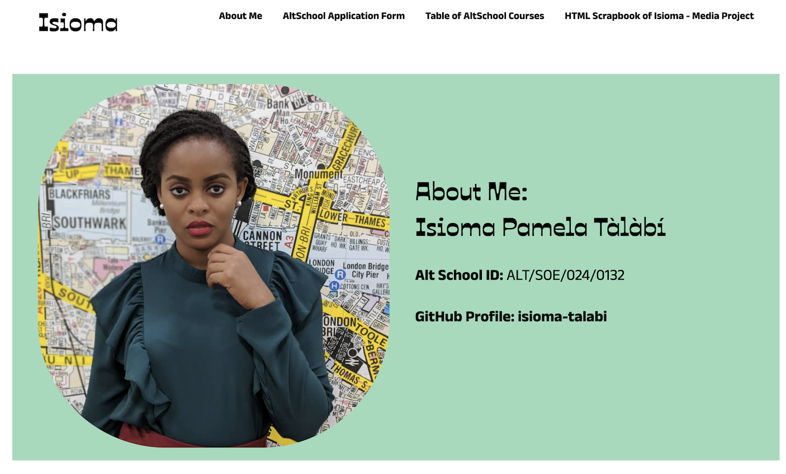

# Altschool Assignment Part 1 & 2 - HTML & CSS

## Screenshot

## Overview

This is a solution to my first semester assignment at Altschool Africa for my Front End Engineering Diploma. The assignment contains 4 pages built with HTML and styled with CSS. 
A list of the files all available in the navigation bar include:
- `.index.html` - An about me page detailing my biography and my reason for applying to the Altschool Africa Diploma.
- `.form.html` - A replication of the Altschool Africa application form.
- `.table.html` - A table showing all the couses available at Altschool Africa.
- `.media.html` - A media project with picture elements and coded to be responsive to different screens using HTML.

## My process

I built out all the pages using semantic HTML and designed the pages with CSS. It was a bit challenging without design files. 
A lot of work went into the `.media.html` because I had to resize pictures to make them responsive to various screen sizes.
I discovered that putting the pictures within folders created a problem where they were not responsive on the browser. 
So I have had to make do with the pictures and my html files sitting all together in my explorer- a bit messy for my liking.

### What I learned

This assignment enabled me to practice the following:

- Using the `srcset` element to make pictures responsive with HTML.
- Practicing with `display: flex` and `display: grid` CSS properties to design web pages.
- Creating and styling a form with CSS.
- Designing tables with CSS.

### Built with

- Semantic HTML5 markup
- CSS custom properties
- Flexbox
- Grid Layouts

### Continued development

Things I will be learning in the comimg weeks:

- Mastering Grid Layouts with CSS
- Media queries with CSS
- Positioning with CSS
- Javascript

### Links

- Solution URL: [Solution URL](https://github.com/isioma-talabi/Altschool-Africa-Assignment-First-Semester)
- Live Site URL: [Live site URL](https://isioma-talabi.github.io/Altschool-Africa-Assignment-First-Semester/media.html)